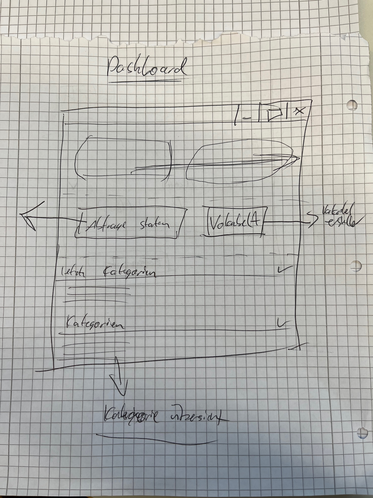
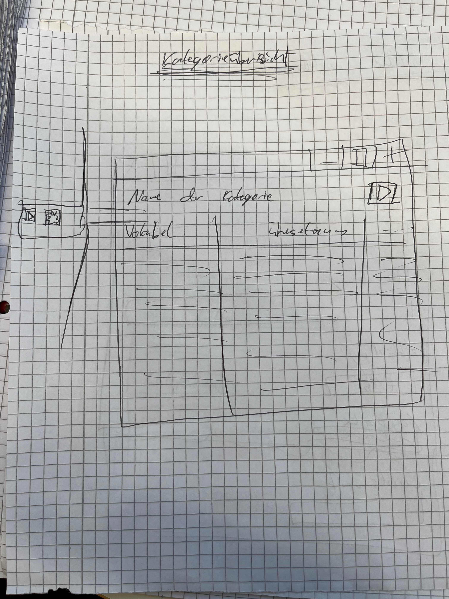
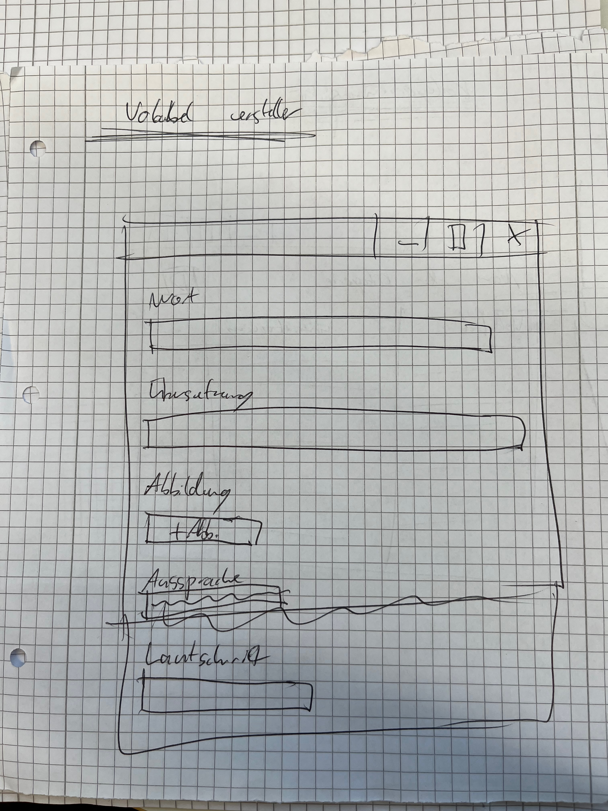

# UI

## Screens

### Dashboard

- Lernfortschritt / Statistiken
- Abfrage starten Button
- Vokabel Hinzufügen Button -> Vokabelersteller
- Kategorien anzeigen
    - Kategorien (letzte) -> Kategorieübersicht
    - Kategorien (alle) -> Kategorieübersicht
        - wenn leer: Kategorie erstellen

### Kategorieübersicht

- Kategoriename
- Tabelle
    - Vokabel

### Vokabelersteller

- Eingabefelder
    - Wort
    - Übersetzung
    - Abbildung
    - Aussprache
    - Lautschrift
